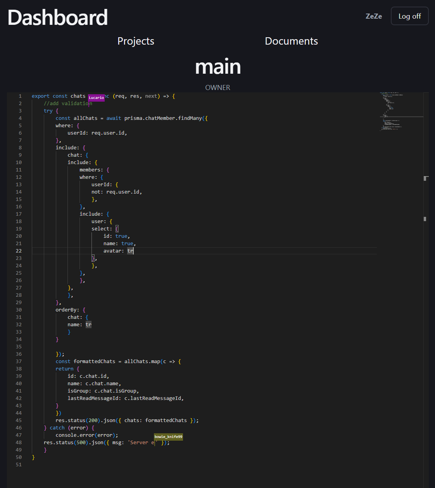
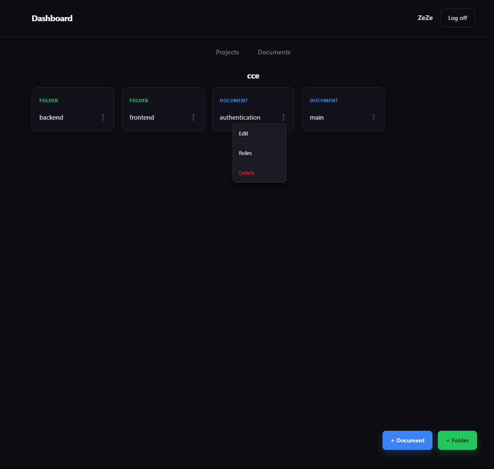

# Collaborative-Code-Editor
A collaborative code editor that enables real-time multi-editing with conflict-free synchronization.
👉 [View deployed app](https://collaborative-code-editor-iota-seven.vercel.app/)

<div align="center">
  
  
</div>

## WHY?
Code reviews are needed when working in projects. This enables teams to review and edit code simultaneosly, in the same file, in real time. Reducing the friction of async code review.

## HOW?
Websocket server (HocusPocus) binds with the editor to manage all changes on the file. CRDT's strong eventual consistency algorithm ensures the file changes converge with all local users. Redis as persistence and fast-rehydration layer, single instance, Yjs CRDT for client convergence. PostgreSQL acts as a source of truth.

## Technical Highlights

**Blog Post**
👉 [View Blog](https://dev.to/freddster14/centralized-vs-decentralized-why-modern-collaborative-tools-choose-crdts-132j)

**CI/CD**
- 60+ integration test covering authentication, CRUD, and edgecases
- Branch protection to prevent faulty code to entering main

**Role-Hierchy System**
- Add, edit, and delete multiple users' role to adhere to the document
- Transfer ownership to authority user
- Manage shared documents

**Real-Time Collabarative**
- WebSocket server for live-data and Redis as my persistent storage
- Conflict-free data with Yjs (CRDT)
- Live users' cursor position with username

## Installation

### Prerequisities
- Node.js
- PostgreSQL database URL
- Redis account

Clone repository in desired location
```bash
  cd desired/location && git clone https://github.com/freddster14/Collaborative-Code-Editor
```
Open Collaborative Code Editor
```bash
  cd Collaborative-Code-Editor
```

Add enviroment variables:
- Create ``` .env ``` file in root of folder
- Add variables to the newly created ``` .env ``` file
- In server/express create ``` .env.test ``` file to run test
- View [.env.example](./.env.example) to know what variables are needed

Back to the terminal,  install all needed dependencies
```bash
  npm install
``` 

Run Prisma database migration & generate client
```bash
  cd packages/prisma && npx prisma migrate deploy && npx prisma generate
```
Return to root
```bash
  cd ../../
```
Start server instance of server/express
```bash
  cd server/express && npm run dev
```

In another terminal star server instace of server/hocuspocus (from the project root)
```bash
  cd server/hocuspocus && npm run dev
```

In another terminal star server instace of client (from the project root)
```bash
  cd client && npm run dev
```

Collabarative Code Editor is now running:
- Open in browser: http://localhost:5173
